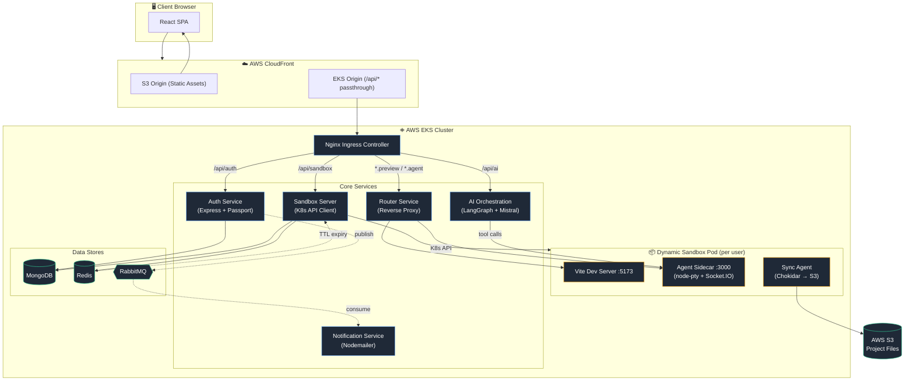
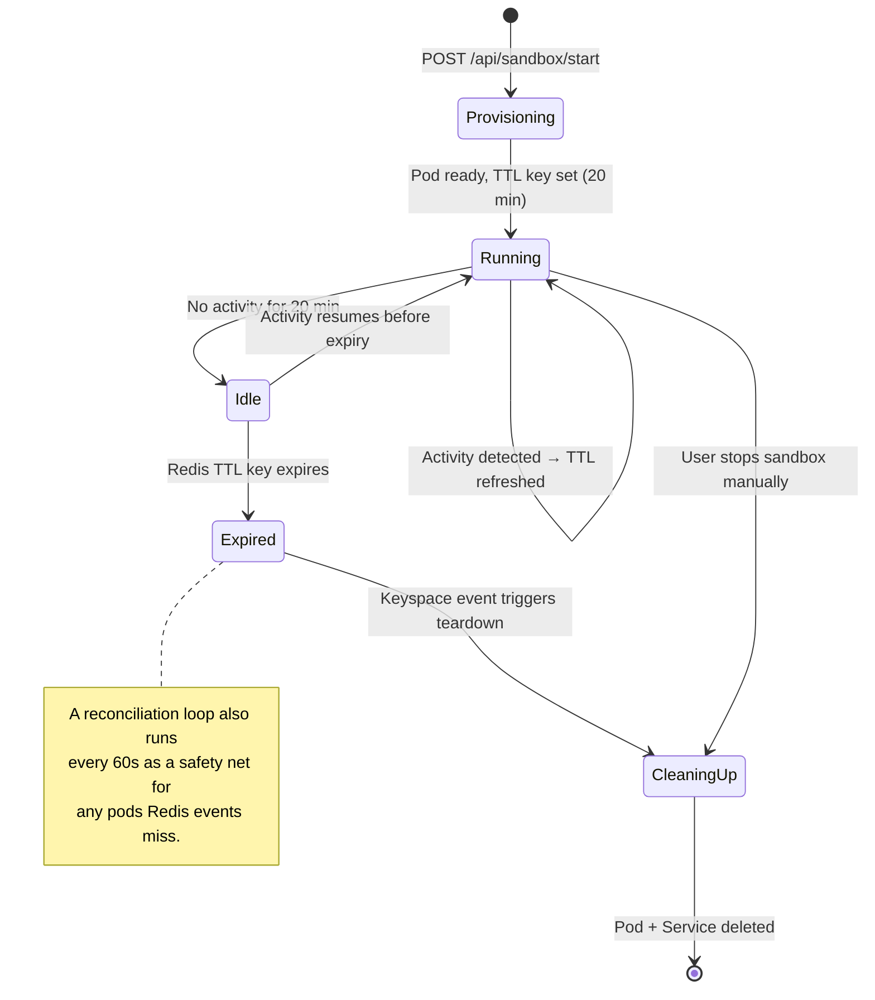
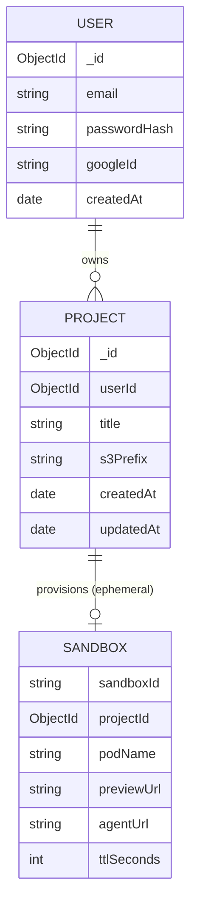
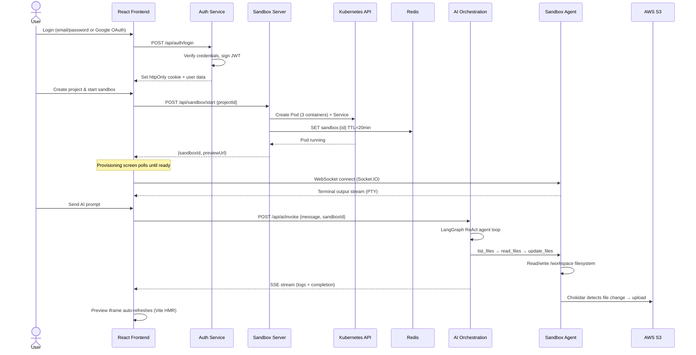

<div align="center">

# ⚡ CodeSpaces

### AI-Powered Cloud IDE for React Development

**Spin up an isolated, containerized dev environment in seconds — complete with a live preview, a real terminal, and an AI agent that writes production-quality frontend code on demand.**

[](https://nodejs.org)
[](https://react.dev)
[](https://kubernetes.io)
[](https://mistral.ai)
[](#license)

[Overview](#overview) • [Features](#key-features) • [Architecture](#system-architecture) • [Setup](#setup--installation) • [API](#api-reference) • [Roadmap](#future-improvements--roadmap)

</div>

---

## Overview

**CodeSpaces** is a cloud-native development platform that provisions isolated, containerized coding environments on demand. Users authenticate, create a project, and instantly receive a fully functional sandbox — a live preview, an integrated terminal, a file explorer, and an AI assistant powered by **Mistral AI** via **LangGraph**.

The platform targets frontend developers who want to prototype, experiment, or build React applications without configuring local toolchains, while leveraging AI to accelerate development from idea to working UI.

| | |
|---|---|
| 🔐 **Auth** | Google OAuth 2.0 + email/password, JWT sessions over httpOnly cookies |
| 🧠 **AI Agent** | LangGraph ReAct agent on Mistral Large, streamed over SSE |
| 📦 **Sandboxes** | Ephemeral, multi-container Kubernetes pods with TTL-based cleanup |
| 💾 **Persistence** | Bi-directional S3 sync of the `/workspace` directory |
| 🌐 **Routing** | Wildcard subdomain reverse proxy for per-sandbox preview & agent access |

---

## Key Features

### 🔐 Authentication & Security
- **Dual authentication flow** — Google OAuth 2.0 (via Passport.js) and email/password registration with PBKDF2-SHA512 password hashing.
- **JWT-based session management** — httpOnly cookie tokens protect against XSS while enabling seamless cross-service auth across the microservice architecture.
- **Login activity notifications** — every auth event (login, registration, OAuth) publishes to RabbitMQ, triggering real-time email alerts via Nodemailer with OAuth2 transport.

### 🧠 AI Code Generation
- **LangGraph ReAct agent** powered by Mistral AI (`mistral-large-latest`) — follows a structured *list → read → reason → update* workflow to generate, modify, and refactor React components directly inside the user's sandbox.
- **SSE streaming** — AI responses stream in real time with tool-use status updates, heartbeat keep-alives, and graceful error handling for full visibility into the agent's reasoning.
- **Built-in rate limiting** — a sliding-window limiter (3 requests/minute) guards the Mistral API from quota exhaustion during long multi-file generation sessions.

### 📦 Sandbox Infrastructure
- **Dynamic Kubernetes pod provisioning** — each sandbox is a multi-container pod: a Vite dev server (live preview), a Socket.IO agent (terminal + file ops), and an S3 sync agent (persistence).
- **Automatic TTL-based cleanup** — Redis keys with a 20-minute TTL track sandbox activity; on expiry, a keyspace event listener tears down the pod and service. A reconciliation loop runs every 60 seconds as a safety net.
- **Activity-aware TTL refresh** — every HTTP/WebSocket request through the router service resets the TTL, so active sessions never expire prematurely.
- **Persistent project storage** — the sync agent watches `/workspace` with Chokidar and bi-directionally syncs files to/from AWS S3.

### 🛠️ Developer Experience
- **Live preview panel** — an embedded iframe renders the sandbox's Vite dev server output for instant visual feedback.
- **Integrated web terminal** — a full PTY-backed terminal (node-pty + xterm.js) over Socket.IO for real shell access.
- **File explorer** — a tree-view browser of the sandbox filesystem for navigation and AI context.
- **Resizable multi-panel layout** — drag handles between explorer, preview, terminal, and AI chat with smooth, clamped resizing.

### ☁️ Infrastructure & DevOps
- **Wildcard subdomain routing** — Nginx Ingress with wildcard CNAMEs routes `{sandboxId}.preview.code-spaces.online` and `{sandboxId}.agent.code-spaces.online` to the correct pod.
- **Production-grade deployment on AWS EKS** — containerized with Skaffold, ECR-hosted images, CloudFront CDN, ACM-managed TLS, HPA + Cluster Autoscaler.
- **Health checks and readiness probes** — every service exposes `/healthz` and `/readyz` for zero-downtime rolling deployments.

---

## Tech Stack

<table>
<tr><th>Layer</th><th>Technology</th><th>Purpose</th></tr>
<tr><td rowspan="5"><b>Frontend</b></td><td>React 19, Vite 8</td><td>Single-page application, component-based architecture</td></tr>
<tr><td>Redux Toolkit</td><td>Global state management for the authentication flow</td></tr>
<tr><td>TailwindCSS 4</td><td>Utility-first styling, VS Code–inspired dark theme</td></tr>
<tr><td>Monaco Editor, xterm.js</td><td>Code editing and integrated terminal UI</td></tr>
<tr><td>Socket.IO Client</td><td>Real-time WebSocket communication with the sandbox agent</td></tr>
<tr><td rowspan="3"><b>Backend</b></td><td>Node.js, Express 5</td><td>RESTful API servers for every microservice</td></tr>
<tr><td>Passport.js</td><td>Google OAuth 2.0 authentication strategy</td></tr>
<tr><td>JSON Web Tokens</td><td>Stateless session management across services</td></tr>
<tr><td rowspan="2"><b>AI</b></td><td>LangChain, LangGraph</td><td>ReAct agent orchestration with tool-use</td></tr>
<tr><td>Mistral AI (<code>mistral-large</code>)</td><td>LLM for code generation</td></tr>
<tr><td><b>Database</b></td><td>MongoDB (Mongoose)</td><td>User accounts and project metadata</td></tr>
<tr><td><b>Cache</b></td><td>Redis (ioredis)</td><td>Sandbox TTL tracking, keyspace expiration events</td></tr>
<tr><td><b>Messaging</b></td><td>RabbitMQ (amqplib)</td><td>Async events between auth and notification services</td></tr>
<tr><td><b>Email</b></td><td>Nodemailer</td><td>OAuth2-authenticated transactional email</td></tr>
<tr><td><b>Storage</b></td><td>AWS S3</td><td>Persistent file storage for sandbox projects</td></tr>
<tr><td rowspan="2"><b>Containers / Orchestration</b></td><td>Docker, Skaffold</td><td>Multi-service container builds with hot-reload sync</td></tr>
<tr><td>Kubernetes (EKS)</td><td>Dynamic pod/service lifecycle for sandboxes</td></tr>
<tr><td rowspan="3"><b>Networking</b></td><td>Nginx Ingress Controller</td><td>Path-based and wildcard subdomain routing with SSL termination</td></tr>
<tr><td>AWS CloudFront</td><td>Frontend static asset delivery, API pass-through</td></tr>
<tr><td>AWS ACM</td><td>Managed TLS certificates for <code>code-spaces.online</code> and wildcards</td></tr>
<tr><td><b>Reverse Proxy</b></td><td>httpxy, http-proxy-middleware</td><td>Dynamic per-sandbox proxying with WebSocket upgrade support</td></tr>
<tr><td><b>File Watching</b></td><td>Chokidar</td><td>Real-time filesystem monitoring for S3 sync</td></tr>
<tr><td><b>Terminal</b></td><td>node-pty, Socket.IO</td><td>Server-side pseudo-terminal with WebSocket relay</td></tr>
</table>

---

## System Architecture



The architecture follows a **microservices pattern** where each domain concern — auth, AI, sandboxing, notifications — runs as an independently deployable service. Sandboxes are ephemeral Kubernetes pods with a multi-container sidecar pattern: the Vite dev server handles live preview, the agent sidecar manages terminal I/O and file operations, and the sync agent ensures persistence. The router service is a dynamic reverse proxy that maps wildcard subdomains to the correct sandbox pod without requiring Ingress reconfiguration.

---

## Sandbox Lifecycle

A sandbox's state is driven by Redis TTL keys and keyspace notifications, not by a long-running scheduler:



---

## Core Data Model



---

## Application Flow — Sandbox Creation & AI Code Generation



1. **Authentication** — the user logs in via local credentials or Google OAuth; the auth service issues a JWT stored as an httpOnly cookie and publishes a login notification to RabbitMQ.
2. **Sandbox provisioning** — when the user starts a project, the sandbox server programmatically creates a Kubernetes pod (with an init container for template seeding), a ClusterIP service, and a Redis TTL key. The frontend polls until the sandbox is ready.
3. **Interactive development** — the React frontend connects to the sandbox agent over Socket.IO for terminal access and fetches the filesystem for the file explorer. The live preview iframe points to the sandbox's Vite dev server.
4. **AI-assisted coding** — user prompts are routed to the AI orchestration service, which runs a LangGraph ReAct agent. The agent uses tool calls (`list_files`, `read_files`, `update_files`) to inspect and modify the sandbox filesystem through the agent sidecar. Progress streams back via SSE.
5. **Persistence** — the sync agent watches the workspace with Chokidar and uploads changed files to S3. On the next sandbox start, files are restored from S3 before the watcher begins.

---

## Folder Structure

```
Capstone/
├── auth/                          # Authentication microservice
│   ├── src/
│   │   ├── config/
│   │   │   ├── db.js              # MongoDB connection
│   │   │   └── mq.js              # RabbitMQ producer (auth events)
│   │   ├── middlewares/
│   │   │   └── auth.middleware.js  # JWT verification middleware
│   │   ├── models/
│   │   │   └── user.model.js      # Mongoose user schema
│   │   ├── routes/
│   │   │   └── auth.routes.js     # OAuth, login, register, logout endpoints
│   │   └── app.js                 # Express app with Passport config
│   ├── server.js                  # HTTP server entry point
│   └── dockerfile
│
├── ai-orchestration/              # AI code generation service
│   ├── src/
│   │   ├── agents/
│   │   │   ├── code.agent.js      # LangGraph ReAct agent with Mistral LLM
│   │   │   └── tools.js           # list_files, read_files, update_files tools
│   │   ├── routes/
│   │   │   └── agent.routes.js    # SSE streaming endpoint for AI invocation
│   │   └── app.js
│   ├── server.js
│   └── dockerfile
│
├── notification/                  # Email notification consumer service
│   ├── src/
│   │   ├── app.js                 # RabbitMQ consumer + Express health checks
│   │   ├── email.js               # Nodemailer OAuth2 transport config
│   │   └── mq.js                  # RabbitMQ channel setup
│   ├── server.js
│   └── dockerfile
│
├── sandbox/                       # Sandbox infrastructure (5 sub-services)
│   ├── server/                    # Sandbox orchestration API
│   │   └── src/
│   │       ├── config/
│   │       │   ├── db.js          # MongoDB connection
│   │       │   └── redis.js       # Redis TTL management + reconciliation
│   │       ├── kubernetes/
│   │       │   ├── config.js      # K8s client initialization
│   │       │   ├── pod.js         # Pod creation/deletion (multi-container spec)
│   │       │   └── service.js     # ClusterIP service management
│   │       ├── middlewares/
│   │       │   └── auth.middleware.js
│   │       ├── models/
│   │       │   └── project.model.js
│   │       └── routes/
│   │           └── sandbox.routes.js  # CRUD projects + start sandbox
│   ├── agent/                     # Sidecar: PTY terminal + file API
│   │   └── src/
│   │       └── app.js             # Socket.IO terminal + REST file operations
│   ├── router/                    # Dynamic reverse proxy
│   │   └── src/
│   │       ├── app.js             # Wildcard subdomain → sandbox pod proxying
│   │       └── config/
│   │           └── redis.js       # TTL refresh on activity
│   ├── sync-agent/                # Sidecar: S3 file sync
│   │   └── sync.js               # Chokidar watcher → S3 upload/download
│   └── template/                  # Base React + Vite project template
│       └── src/                   # Default app scaffolding seeded into sandboxes
│
├── frontend/                      # React SPA (Vite)
│   └── src/
│       ├── components/
│       │   ├── AIChatPanel.jsx    # AI chat interface with SSE streaming
│       │   ├── FileExplorer.jsx   # Sandbox filesystem tree view
│       │   ├── PreviewPanel.jsx   # Live preview iframe
│       │   ├── TerminalPanel.jsx  # xterm.js terminal connected via Socket.IO
│       │   ├── TopNav.jsx         # Navigation bar with project controls
│       │   ├── WelcomeScreen.jsx  # Project dashboard & sandbox launcher
│       │   ├── ProvisioningScreen.jsx  # Sandbox boot-up loading UI
│       │   ├── LoginPage.jsx      # Email/password + Google OAuth login
│       │   └── RegisterPage.jsx   # User registration form
│       ├── context/
│       │   ├── SandboxContext.jsx  # Sandbox lifecycle state management
│       │   ├── FileSystemContext.jsx  # File tree state & API calls
│       │   └── AIChatContext.jsx  # AI chat history & SSE stream handling
│       ├── store/
│       │   ├── store.js           # Redux store configuration
│       │   └── authSlice.js       # Auth async thunks & state
│       ├── hooks/
│       │   └── useLayoutDrag.js   # Custom hook for resizable panel dragging
│       ├── route.jsx              # React Router with auth guards
│       └── App.jsx                # Root component with provider composition
│
├── K8s/                           # Kubernetes manifests
│   ├── *-deployment.yml           # Deployment specs for each service
│   ├── *-service.yml              # ClusterIP service definitions
│   ├── ingress.yml                # Nginx Ingress with wildcard routing
│   ├── rbac.yml                   # RBAC for sandbox K8s API access
│   └── secrets.yml                # Environment secrets (base64 encoded)
│
├── skaffold.yml                   # Local development build/deploy pipeline
├── skaffold-eks.yml               # Production EKS build/deploy pipeline
└── EKS-deployment-windows.md      # Step-by-step AWS deployment guide
```

---

## Setup & Installation

### Prerequisites

| Requirement | Notes |
|---|---|
| Node.js 20+ | Runtime for all services |
| Docker Desktop with Kubernetes enabled | Local cluster for `skaffold dev` |
| kubectl | Configured against your cluster (local or EKS) |
| Skaffold CLI | Build/deploy pipeline orchestration |
| MongoDB | Local instance or Atlas |
| Redis | TTL tracking + keyspace events |
| RabbitMQ | Auth → notification event bus |
| Mistral AI API key | Powers the LangGraph code agent |
| Google OAuth 2.0 credentials | For social login |
| AWS credentials | Required for S3 sandbox sync |

### 1. Clone the repository

```bash
git clone https://github.com/<your-username>/codespaces.git
cd codespaces
```

### 2. Configure environment variables

**`auth/src/.env`**
```env
AUTH_MONGO_URI=mongodb://localhost:27017/codespace-auth
jwt_secret=your_jwt_secret
GOOGLE_CLIENT_ID=your_google_client_id
GOOGLE_CLIENT_SECRET=your_google_client_secret
RABBITMQ_URL=amqp://localhost:5672
```

**`ai-orchestration/.env`**
```env
MISTRAL_API_KEY=your_mistral_api_key
```

**`notification/.env`** *(set via K8s secrets in production)*
```env
RABBITMQ_URL=amqp://localhost:5672
EMAIL_USER=your_email@gmail.com
GOOGLE_CLIENT_ID=your_google_client_id
GOOGLE_CLIENT_SECRET=your_google_client_secret
GOOGLE_REFRESH_TOKEN=your_google_refresh_token
```

**`sandbox/server/.env`** *(set via K8s secrets in production)*
```env
SANDBOX_MONGO_URI=mongodb://localhost:27017/codespace-sandbox
REDIS_URL=redis://localhost:6379
jwt_secret=your_jwt_secret
```

> ⚠️ Never commit real `.env` files. Use `K8s/secrets.yml` (base64-encoded) for production secrets, and add `.env` to `.gitignore`.

### 3. Run with Skaffold (recommended)

```bash
skaffold dev
```
This builds all Docker images, deploys to the local Kubernetes cluster, and enables hot-reload across every service.

### 4. Run the frontend

```bash
cd frontend
npm install
npm run dev
```

### 5. Production deployment

Follow the full [EKS-deployment-windows.md](EKS-deployment-windows.md) guide for AWS deployment, including ECR image pushes, CloudFront/ACM setup, and Ingress wildcard DNS configuration.

---

## API Reference

### Auth Service

| Method | Endpoint | Description | Auth |
|:---|:---|:---|:---:|
| `GET` | `/api/auth/google` | Initiate Google OAuth 2.0 login flow | — |
| `GET` | `/api/auth/google/callback` | OAuth callback — creates/finds user, sets JWT cookie | — |
| `POST` | `/api/auth/register` | Register with email/password, returns user object | — |
| `POST` | `/api/auth/login` | Login with email/password, returns user object | — |
| `GET` | `/api/auth/me` | Fetch authenticated user profile | ✅ |
| `POST` | `/api/auth/logout` | Clear JWT cookie and terminate session | — |

### Sandbox Service

| Method | Endpoint | Description | Auth |
|:---|:---|:---|:---:|
| `POST` | `/api/sandbox/project` | Create a new project | ✅ |
| `GET` | `/api/sandbox/projects` | List all projects for the authenticated user | ✅ |
| `PATCH` | `/api/sandbox/project/:id` | Update project title | ✅ |
| `DELETE` | `/api/sandbox/project/:id` | Delete a project | ✅ |
| `POST` | `/api/sandbox/start` | Provision a sandbox pod for a project | ✅ |

### AI Orchestration Service

| Method | Endpoint | Description | Auth |
|:---|:---|:---|:---:|
| `POST` | `/api/ai/invoke` | Invoke the AI agent — returns an SSE stream with logs and completion | * |

<sub>* Requires `sandboxId` via request body, header, or subdomain.</sub>

### Sandbox Agent *(per-sandbox, internal)*

| Method | Endpoint | Description | Auth |
|:---|:---|:---|:---:|
| `GET` | `/list-files` | List all files in `/workspace` (excludes `node_modules`, `.git`, `dist`) | — |
| `GET` | `/read-files?files=...` | Read content of specified files | — |
| `PATCH` | `/update-files` | Create or overwrite files with provided content | — |
| `POST` | `/create-files` | Create new files in the workspace | — |

---

## Future Improvements / Roadmap

- [ ] **Multi-language sandbox templates** — extend beyond React/Vite to Next.js, Vue, Svelte, and plain HTML/CSS/JS templates, selectable at project creation time.
- [ ] **Real-time collaboration** — Yjs or CRDT-based conflict resolution for multiple users coding in the same sandbox simultaneously, with cursor presence and live editing.
- [ ] **Persistent terminal sessions** — tmux/screen inside the sandbox container to preserve terminal state across page reloads and disconnections.
- [ ] **AI conversation memory** — persist conversation history per project in MongoDB so the agent can reference prior context and build iteratively across sessions.
- [ ] **Usage analytics dashboard** — track sandbox uptime, AI invocation frequency, and resource consumption per user for usage-based billing and platform health insight.

---

## Contributing

Contributions are welcome. Please open an issue to discuss significant changes before submitting a pull request.

1. Fork the repository and create a feature branch (`git checkout -b feature/my-feature`)
2. Commit your changes with clear, descriptive messages
3. Run `skaffold dev` to verify the full stack still builds and runs
4. Open a pull request describing the change and its motivation

---

## License

Distributed under the [MIT License](LICENSE).

<div align="center">

<sub>Built with React, Node.js, Kubernetes, and a bit of AI magic.</sub>

</div>