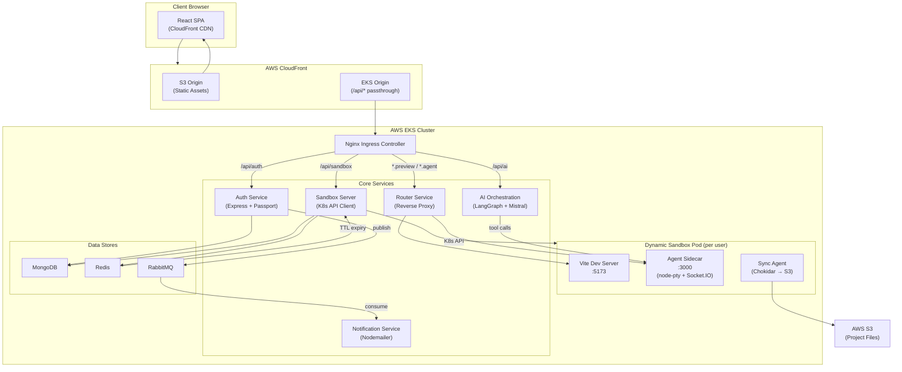
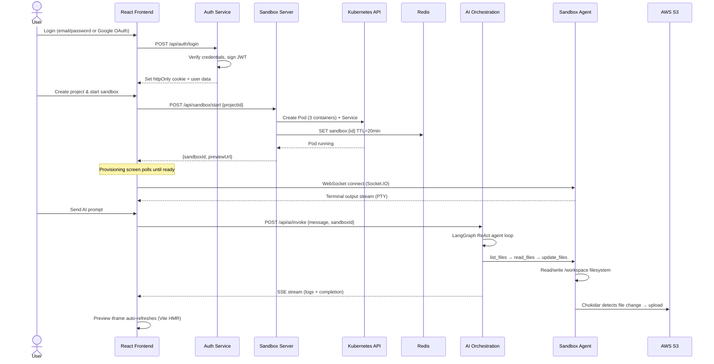

# CodeSpaces — AI-Powered Cloud IDE

**Build, preview, and iterate on React applications entirely in the browser, with an AI coding agent that writes production-quality frontend code on demand.**

---

## Overview

CodeSpaces is a cloud-native development platform that provisions isolated, containerized coding environments on-demand. Users authenticate, create projects, and instantly receive a fully functional sandbox — complete with a live preview, an integrated terminal, a file explorer, and an AI assistant powered by Mistral AI via LangGraph. The platform targets frontend developers who want to prototype, experiment, or build React applications without configuring local toolchains, while leveraging AI to accelerate development.

---

## Key Features

### Authentication & Security
- **Dual authentication flow** — supports both Google OAuth 2.0 (via Passport.js) and traditional email/password registration with PBKDF2-SHA512 password hashing, giving users flexibility without compromising security.
- **JWT-based session management** — httpOnly cookie tokens protect against XSS attacks while enabling seamless cross-service authentication across the microservice architecture.
- **Login activity notifications** — every authentication event (login, registration, OAuth) publishes a message to RabbitMQ, triggering real-time email alerts via Nodemailer with OAuth2 transport.

### AI Code Generation
- **LangGraph ReAct agent** powered by Mistral AI (`mistral-large-latest`) — the AI agent follows a structured list → read → reason → update workflow to generate, modify, and refactor React components directly inside the user's sandbox.
- **Server-Sent Events (SSE) streaming** — AI responses stream in real-time with tool-use status updates, heartbeat keep-alive signals, and graceful error handling, providing transparent visibility into the agent's thought process.
- **Built-in rate limiting** — a custom HTTP client enforces a sliding-window rate limit (3 requests/minute) against the Mistral API, preventing quota exhaustion during long multi-file generation sessions.

### Sandbox Infrastructure
- **Dynamic Kubernetes pod provisioning** — each sandbox spins up a multi-container pod with three sidecars: a Vite dev server (live preview), a Socket.IO agent (terminal + file operations), and an S3 sync agent (persistent storage).
- **Automatic TTL-based resource cleanup** — Redis keys with 20-minute TTL track sandbox activity; on expiration, a keyspace event listener automatically tears down the pod and service, preventing orphaned resources. A reconciliation loop runs every 60 seconds as a safety net.
- **Activity-aware TTL refresh** — every HTTP/WebSocket request proxied through the router service resets the sandbox TTL, so active sessions never expire prematurely.
- **Persistent project storage** — the sync agent watches the `/workspace` directory with Chokidar and bi-directionally syncs files to/from AWS S3, ensuring project state survives sandbox restarts.

### Developer Experience
- **Live preview panel** — an embedded iframe renders the sandbox's Vite dev server output, giving instant visual feedback as the AI agent or user modifies code.
- **Integrated web terminal** — a full PTY-backed terminal (node-pty + xterm.js) connected over Socket.IO provides shell access inside the sandbox container.
- **File explorer** — a tree-view file browser fetches and displays the sandbox filesystem, enabling navigation and context for AI interactions.
- **Resizable multi-panel layout** — drag handles between the file explorer, preview, terminal, and AI chat panels allow users to customize their workspace layout with smooth, clamped resizing.

### Infrastructure & DevOps
- **Wildcard subdomain routing** — an Nginx Ingress controller with wildcard CNAME records routes `{sandboxId}.preview.code-spaces.online` and `{sandboxId}.agent.code-spaces.online` to the correct sandbox pod via an intelligent reverse proxy.
- **Production-grade deployment on AWS EKS** — fully containerized with Skaffold, deployed to an EKS cluster with ECR-hosted images, CloudFront CDN for the frontend, ACM-managed SSL certificates, and HPA + Cluster Autoscaler for elastic scaling.
- **Health checks and readiness probes** — every microservice exposes `/healthz` and `/readyz` endpoints, enabling Kubernetes liveness/readiness probes for zero-downtime deployments.

---

## Tech Stack

| Layer | Technology | Purpose |
|:---|:---|:---|
| **Frontend** | React 19, Vite 8 | Single-page application with component-based architecture |
| **Frontend** | Redux Toolkit | Global state management for authentication flow |
| **Frontend** | TailwindCSS 4 | Utility-first styling with VS Code–inspired dark theme |
| **Frontend** | Monaco Editor, xterm.js | Code editing and integrated terminal experience |
| **Frontend** | Socket.IO Client | Real-time WebSocket communication with sandbox agent |
| **Backend** | Node.js, Express 5 | RESTful API servers for all microservices |
| **Backend** | Passport.js | Google OAuth 2.0 authentication strategy |
| **Backend** | JSON Web Tokens | Stateless session management across services |
| **AI** | LangChain, LangGraph | ReAct agent orchestration with tool-use capabilities |
| **AI** | Mistral AI (`mistral-large`) | Large language model for code generation |
| **Database** | MongoDB (Mongoose) | User accounts and project metadata persistence |
| **Cache** | Redis (ioredis) | Sandbox TTL tracking, keyspace expiration events |
| **Messaging** | RabbitMQ (amqplib) | Async event-driven communication between auth and notification services |
| **Email** | Nodemailer | OAuth2-authenticated transactional email delivery |
| **Storage** | AWS S3 | Persistent file storage for sandbox project files |
| **Containers** | Docker, Skaffold | Multi-service container builds with hot-reload sync |
| **Orchestration** | Kubernetes (EKS) | Dynamic pod/service lifecycle management for sandboxes |
| **Networking** | Nginx Ingress Controller | Path-based and wildcard subdomain routing with SSL termination |
| **CDN** | AWS CloudFront | Frontend static asset delivery with API pass-through |
| **SSL** | AWS ACM | Managed TLS certificates for `code-spaces.online` and wildcards |
| **Reverse Proxy** | httpxy, http-proxy-middleware | Dynamic per-sandbox reverse proxying with WebSocket upgrade support |
| **File Watching** | Chokidar | Real-time filesystem monitoring for S3 sync |
| **Terminal** | node-pty, Socket.IO | Server-side pseudo-terminal with WebSocket relay |

---

## System Architecture



The architecture follows a **microservices pattern** where each domain concern (auth, AI, sandboxing, notifications) runs as an independently deployable service. Sandboxes are provisioned as ephemeral Kubernetes pods with a multi-container sidecar pattern — the Vite dev server handles live preview, the agent sidecar manages terminal I/O and file operations, and the sync agent ensures persistent storage. The router service acts as a dynamic reverse proxy, mapping wildcard subdomains to the correct sandbox pod without requiring Ingress reconfiguration.

---

## Application Flow — Sandbox Creation & AI Code Generation



1. **Authentication** — the user logs in via local credentials or Google OAuth; the auth service issues a JWT stored as an httpOnly cookie and publishes a login notification to RabbitMQ.
2. **Sandbox provisioning** — when the user starts a project, the sandbox server programmatically creates a Kubernetes pod (with init container for template seeding), a ClusterIP service, and a Redis TTL key. The frontend polls until the sandbox is ready.
3. **Interactive development** — the React frontend connects to the sandbox agent over Socket.IO for terminal access and fetches the filesystem for the file explorer. The live preview iframe points to the sandbox's Vite dev server.
4. **AI-assisted coding** — user prompts are routed to the AI orchestration service, which runs a LangGraph ReAct agent. The agent uses tool calls (list_files, read_files, update_files) to inspect and modify the sandbox filesystem through the agent sidecar. Progress streams back via SSE.
5. **Persistence** — the sync agent watches the workspace with Chokidar and uploads changed files to S3. On the next sandbox start, files are restored from S3 before the watcher begins.

---

## Folder Structure

```
Capstone/
├── auth/                          # Authentication microservice
│   ├── src/
│   │   ├── config/
│   │   │   ├── db.js              # MongoDB connection
│   │   │   └── mq.js              # RabbitMQ producer (auth events)
│   │   ├── middlewares/
│   │   │   └── auth.middleware.js  # JWT verification middleware
│   │   ├── models/
│   │   │   └── user.model.js      # Mongoose user schema
│   │   ├── routes/
│   │   │   └── auth.routes.js     # OAuth, login, register, logout endpoints
│   │   └── app.js                 # Express app with Passport config
│   ├── server.js                  # HTTP server entry point
│   └── dockerfile
│
├── ai-orchestration/              # AI code generation service
│   ├── src/
│   │   ├── agents/
│   │   │   ├── code.agent.js      # LangGraph ReAct agent with Mistral LLM
│   │   │   └── tools.js           # list_files, read_files, update_files tools
│   │   ├── routes/
│   │   │   └── agent.routes.js    # SSE streaming endpoint for AI invocation
│   │   └── app.js
│   ├── server.js
│   └── dockerfile
│
├── notification/                  # Email notification consumer service
│   ├── src/
│   │   ├── app.js                 # RabbitMQ consumer + Express health checks
│   │   ├── email.js               # Nodemailer OAuth2 transport config
│   │   └── mq.js                  # RabbitMQ channel setup
│   ├── server.js
│   └── dockerfile
│
├── sandbox/                       # Sandbox infrastructure (5 sub-services)
│   ├── server/                    # Sandbox orchestration API
│   │   └── src/
│   │       ├── config/
│   │       │   ├── db.js          # MongoDB connection
│   │       │   └── redis.js       # Redis TTL management + reconciliation
│   │       ├── kubernetes/
│   │       │   ├── config.js      # K8s client initialization
│   │       │   ├── pod.js         # Pod creation/deletion (multi-container spec)
│   │       │   └── service.js     # ClusterIP service management
│   │       ├── middlewares/
│   │       │   └── auth.middleware.js
│   │       ├── models/
│   │       │   └── project.model.js
│   │       └── routes/
│   │           └── sandbox.routes.js  # CRUD projects + start sandbox
│   ├── agent/                     # Sidecar: PTY terminal + file API
│   │   └── src/
│   │       └── app.js             # Socket.IO terminal + REST file operations
│   ├── router/                    # Dynamic reverse proxy
│   │   └── src/
│   │       ├── app.js             # Wildcard subdomain → sandbox pod proxying
│   │       └── config/
│   │           └── redis.js       # TTL refresh on activity
│   ├── sync-agent/                # Sidecar: S3 file sync
│   │   └── sync.js               # Chokidar watcher → S3 upload/download
│   └── template/                  # Base React + Vite project template
│       └── src/                   # Default app scaffolding seeded into sandboxes
│
├── frontend/                      # React SPA (Vite)
│   └── src/
│       ├── components/
│       │   ├── AIChatPanel.jsx    # AI chat interface with SSE streaming
│       │   ├── FileExplorer.jsx   # Sandbox filesystem tree view
│       │   ├── PreviewPanel.jsx   # Live preview iframe
│       │   ├── TerminalPanel.jsx  # xterm.js terminal connected via Socket.IO
│       │   ├── TopNav.jsx         # Navigation bar with project controls
│       │   ├── WelcomeScreen.jsx  # Project dashboard & sandbox launcher
│       │   ├── ProvisioningScreen.jsx  # Sandbox boot-up loading UI
│       │   ├── LoginPage.jsx      # Email/password + Google OAuth login
│       │   └── RegisterPage.jsx   # User registration form
│       ├── context/
│       │   ├── SandboxContext.jsx  # Sandbox lifecycle state management
│       │   ├── FileSystemContext.jsx  # File tree state & API calls
│       │   └── AIChatContext.jsx  # AI chat history & SSE stream handling
│       ├── store/
│       │   ├── store.js           # Redux store configuration
│       │   └── authSlice.js       # Auth async thunks & state
│       ├── hooks/
│       │   └── useLayoutDrag.js   # Custom hook for resizable panel dragging
│       ├── route.jsx              # React Router with auth guards
│       └── App.jsx                # Root component with provider composition
│
├── K8s/                           # Kubernetes manifests
│   ├── *-deployment.yml           # Deployment specs for each service
│   ├── *-service.yml              # ClusterIP service definitions
│   ├── ingress.yml                # Nginx Ingress with wildcard routing
│   ├── rbac.yml                   # RBAC for sandbox K8s API access
│   └── secrets.yml                # Environment secrets (base64 encoded)
│
├── skaffold.yml                   # Local development build/deploy pipeline
├── skaffold-eks.yml               # Production EKS build/deploy pipeline
└── EKS-deployment-windows.md      # Step-by-step AWS deployment guide
```

---

## Setup & Installation

### Prerequisites
- Node.js 20+
- Docker Desktop with Kubernetes enabled
- kubectl configured
- Skaffold CLI installed
- MongoDB instance (local or Atlas)
- Redis instance
- RabbitMQ instance
- Mistral AI API key
- Google OAuth 2.0 credentials
- AWS credentials (for S3 sync)

### 1. Clone the repository
```bash
git clone https://github.com/<your-username>/codespaces.git
cd codespaces
```

### 2. Configure environment variables

**`auth/src/.env`**
```env
AUTH_MONGO_URI=mongodb://localhost:27017/codespace-auth
jwt_secret=your_jwt_secret
GOOGLE_CLIENT_ID=your_google_client_id
GOOGLE_CLIENT_SECRET=your_google_client_secret
RABBITMQ_URL=amqp://localhost:5672
```

**`ai-orchestration/.env`**
```env
MISTRAL_API_KEY=your_mistral_api_key
```

**`notification/.env`** (set via K8s secrets in production)
```env
RABBITMQ_URL=amqp://localhost:5672
EMAIL_USER=your_email@gmail.com
GOOGLE_CLIENT_ID=your_google_client_id
GOOGLE_CLIENT_SECRET=your_google_client_secret
GOOGLE_REFRESH_TOKEN=your_google_refresh_token
```

**`sandbox/server/.env`** (set via K8s secrets in production)
```env
SANDBOX_MONGO_URI=mongodb://localhost:27017/codespace-sandbox
REDIS_URL=redis://localhost:6379
jwt_secret=your_jwt_secret
```

### 3. Run with Skaffold (recommended)
```bash
skaffold dev
```
This builds all Docker images, deploys to the local Kubernetes cluster, and enables hot-reload.

### 4. Run the frontend
```bash
cd frontend
npm install
npm run dev
```

### 5. Production deployment
Follow the comprehensive [EKS-deployment-windows.md](EKS-deployment-windows.md) guide for full AWS deployment.

---

## API Reference

### Auth Service

| Method | Endpoint | Description | Auth |
|:---|:---|:---|:---|
| `GET` | `/api/auth/google` | Initiate Google OAuth 2.0 login flow | No |
| `GET` | `/api/auth/google/callback` | Google OAuth callback — creates/finds user, sets JWT cookie | No |
| `POST` | `/api/auth/register` | Register with email/password — returns user object | No |
| `POST` | `/api/auth/login` | Login with email/password — returns user object | No |
| `GET` | `/api/auth/me` | Fetch authenticated user profile | Yes |
| `POST` | `/api/auth/logout` | Clear JWT cookie and terminate session | No |

### Sandbox Service

| Method | Endpoint | Description | Auth |
|:---|:---|:---|:---|
| `POST` | `/api/sandbox/project` | Create a new project | Yes |
| `GET` | `/api/sandbox/projects` | List all projects for authenticated user | Yes |
| `PATCH` | `/api/sandbox/project/:id` | Update project title | Yes |
| `DELETE` | `/api/sandbox/project/:id` | Delete a project | Yes |
| `POST` | `/api/sandbox/start` | Provision a sandbox pod for a project | Yes |

### AI Orchestration Service

| Method | Endpoint | Description | Auth |
|:---|:---|:---|:---|
| `POST` | `/api/ai/invoke` | Invoke the AI agent — returns SSE stream with logs and completion | No* |

*Requires `sandboxId` via request body, header, or subdomain.

### Sandbox Agent (per-sandbox, internal)

| Method | Endpoint | Description | Auth |
|:---|:---|:---|:---|
| `GET` | `/list-files` | List all files in `/workspace` (excludes node_modules, .git, dist) | No |
| `GET` | `/read-files?files=...` | Read content of specified files | No |
| `PATCH` | `/update-files` | Create or overwrite files with provided content | No |
| `POST` | `/create-files` | Create new files in the workspace | No |

---

## Future Improvements / Roadmap

- **Multi-language sandbox templates** — extend beyond React/Vite to support Next.js, Vue, Svelte, and plain HTML/CSS/JS templates, selectable at project creation time.
- **Real-time collaboration** — integrate Yjs or CRDT-based conflict resolution to enable multiple users to code in the same sandbox simultaneously, with cursor presence and live editing.
- **Persistent terminal sessions** — use tmux or screen inside the sandbox container to preserve terminal state across page reloads and browser disconnections.
- **AI conversation memory** — implement conversation history persistence per project using MongoDB, enabling the AI agent to reference prior context and build iteratively across sessions.
- **Usage analytics dashboard** — track sandbox uptime, AI invocation frequency, and resource consumption per user to enable usage-based billing and provide insight into platform health.
